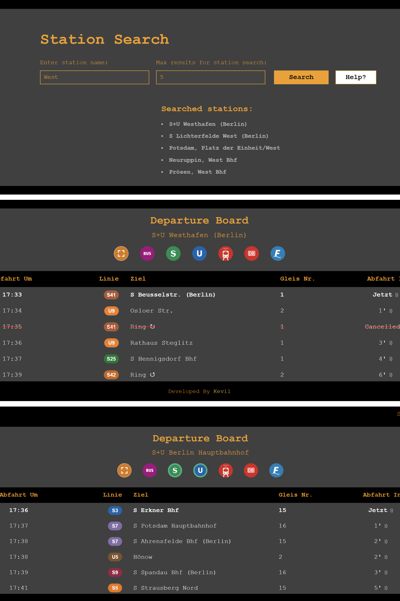

# 🚉 Real-Time Public Transportation Departure Board

**🌟 Overview:**  
Our web application provides **real-time departure information** for public transportation using the VBB REST API. Easily **search stations** by name and view departure times for buses, trains, trams, and ferries. The app shows a **time-sorted list** of upcoming departures that refreshes every **60 seconds**.

**🛠️ Features:**
- 🔍 **Search for stations** and get real-time departure info.
- 🚍 **Filter departures** by transport mode (bus, train, tram, ferry).
- 🖥️ **Full screen mode** for a great experience.
- 🔄 **Auto-updates** every 60 seconds for accurate data.
- ❓ **FAQ section** for users.

**🎯 Target Audience:**  
This app is perfect for **commuters**, **students**, **residents**, and anyone who uses public transportation regularly. For example, a city resident might set up the app on a tablet to show **live departure times** for nearby stations, keeping them up-to-date with the latest schedules.

**💡 User Benefit:**  
The app allows users to **efficiently plan their trips** by offering instant, accurate departure information. The ability to filter by transport mode and save preferences provides a **personalized experience**, making it easier for users to monitor departures and reduce wait times.

### 📸 Screenshots
Here are some screenshots of the application in action:

#### Desktop


#### Mobile/tablet


### 🎥 Screencast
Watch the screencast below to see how the app works:

[Watch the video](https://youtu.be/PvHbxutcP-U?si=8oVganb_DX4kTIAq)

### 🔗 How to Use
1. **Search for a station** by name.
2. **View the departure list** for buses, trains, trams, and ferries.
3. **Filter departures** by transport mode.
4. Enjoy **auto-updates** every 60 seconds.


## 🚀 Getting Started

### Prerequisites
- Python 3.8 or higher
- pip (Python package installer)

### Installation

1. **Clone repository**
    ```bash
    git clone https://github.com/Kevilk/TheBerlinerBahn.git
    cd TheBerlinerBahn
    ```

2. **Set up virtual environment**

    **For Windows:**
    ```bash
    python -m venv venv
    venv\Scripts\activate
    ```

    **For Mac/Linux:**
    ```bash
    python3 -m venv venv
    source venv/bin/activate
    ```

3. **Install dependencies**
    ```bash
    pip install -r requirements.txt
    ```
    
4. **Run application**
    ```bash
    flask run --host=0.0.0.0 --port=5000
    ```

    Access the application at: [http://localhost:5000](http://localhost:5000)

---

## 🚀 Production Deployment

1. **Install production server**
    ```bash
    pip install gunicorn
    ```

2. **Run with Gunicorn**
    ```bash
    gunicorn -w 4 -b 0.0.0.0:5000 app:app
    ```

---

## 📦 Project Structure

```plaintext
├── app.py
├── requirements.txt
├── static/
│   ├── css/
│   │   ├── styles.css
│   │   └── search_styles.css
│   ├── img/
│   └── js/
│       ├── script.js
│       └── search_script.js
├── templates/
│   ├── departures.html
│   ├── error.html
│   └── search.html
├── Procfile
└── README.md
```
### License  
This project is licensed under the [MIT License](LICENSE).  


